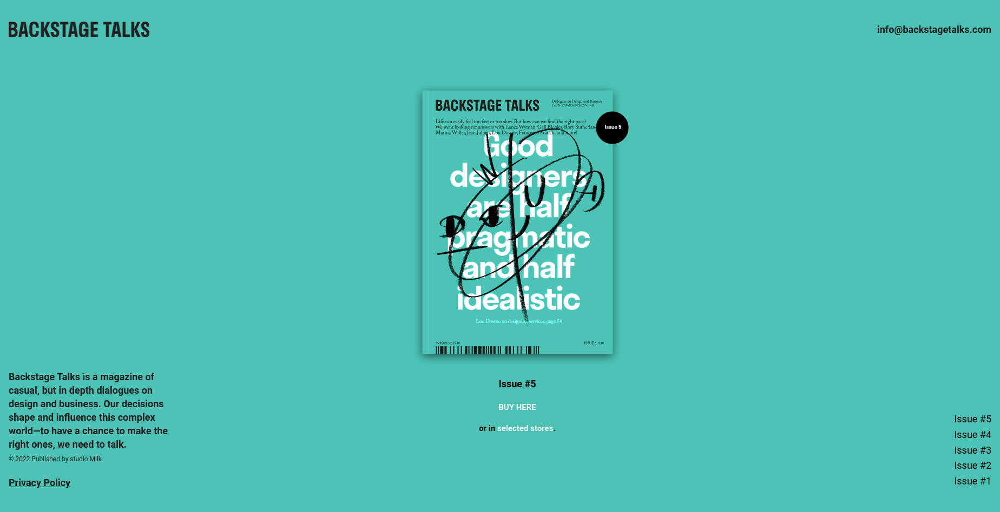

# Unofficial main page of backstage talks magazine

This is a solution to the [Backstage Talks Magazine challenge from Frontendpractice.com](https://www.frontendpractice.com/project/backstage-talks).

## Table of contents

- [Overview](#overview)
  - [Screenshot](#screenshot)
  - [Links](#links)
  - [Setup](#setup)
  - [Status](#status)
- [My process](#my-process)
  - [Built with](#built-with)
  - [What I learned](#what-i-learned)
  - [Continued development](#continued-development)
- [Author](#author)
- [Acknowledgments](#acknowledgments)

## Overview

### Screenshot

### Links

- Live Site URL: [Unofficial Backstage Talks Magazine](https://unofficial-backstage-talks.netlify.app/)

### Setup

- download or clone the repository
- run npm install
- run npm start

### Status

need to do a mobile version and to find another technic for snap-scrolling

## My process

### Built with

- Javascript
- CSS custom properties
- Flexbox
- [React](https://reactjs.org/)

### What I learned

Animations, Fixed positioning, Scroll transition

### Continued development

Snap scrolling, anchor links with react

## Acknowledgments

This is where you can give a hat tip to anyone who helped you out on this project. Perhaps you worked in a team or got some inspiration from someone else's solution. This is the perfect place to give them some credit.

**Note: Delete this note and edit this section's content as necessary. If you completed this challenge by yourself, feel free to delete this section entirely.**
